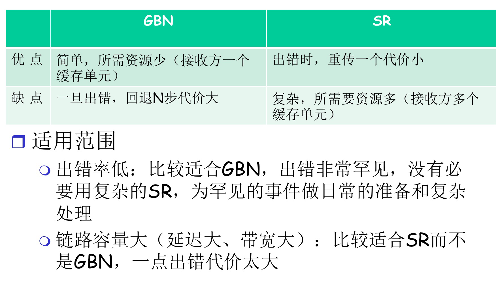

# 可靠数据传输

下层信道(网络层IP协议)的不可靠决定了传输层协议的复杂性，要求传输层协议考虑要考哪些机制向上层提供可靠服务

## rdt协议

rdt: reliable data transfer protocal

### rdt层间接口

使用有限状态机表述发送方和接收方

### rdt 1.0

下层信道完全可靠

rdt工作：

- 复用(make package)和解复用(extract package)

### rdt 2.0

下层信道可能出错，导致分组中比特反转

rdt2.0工作：

- 复用(make package)和解复用(extract package)
- 差错控制编码进行比特差错检测，接收方反馈ACK/NAK，发送方根据反馈做相应动作

### rdt2.1

rdt2.0的致命缺陷：如果ACK/NAK出错怎么办？

rdt2.0工作：

- 复用(make package)和解复用(extract package)

- package带序号，使用差错控制编码进行差错检测(不考虑丢包)

- 对ACK/NAK进行差错检测

  

发送方

收到错误的ACK/NAK都会重发上一个package

接收方

接收方在等待1时却又收到了0，说明上一个ACK出错了

### rdt2.2

功能与rdt2.1相同，但取消了NAK，对ACK加序号

FSM基本与rdt2.1相同，只是将isNAK()替换为isACK()，ACK序号也作为isACK()的参数

### rdt3.0

下层信道除了比特差错，还可能出现丢包

rdt3.0工作：

- 复用(make package)和解复用(extract package)

- package带序号，使用差错控制编码进行差错检测(不考虑丢包)

- ACK带序号，对ACK进行差错检测

- 发送端引入超时重传机制，到时没有收到ACK重传package

发送方(接收方与rdt2.2相同)

rdt3.0性能

rdt3.0一次发一个分组，当链路带宽比较大时，利用率很低

## 流水线协议

流水线：允许发送方在未得到ACK的情况下一次发送多个分组

- **必须增加序号的范围**，用多个比特位表示分组序号
- **发送方和接收方需要设置缓冲区**
  - 发送方buffer：未得到确认的分组需要重传
  - 接收方buffer：接收到的分组可能乱序，需要排序(可靠性)

### Slide window

用窗口表示缓冲区内包含的分组，窗口的滑动表征分组发送和接收情况

发送窗口

- 初始时，前沿=后沿

- 每发送发送一个分组，前沿向前移动，前沿不能超过窗口（缓冲区）范围

- 收到老分组ACK，后沿和缓冲区边界根据情况向前滑动，后沿不能超过前沿

接收窗口

- 分组序号落在接受窗口内才可以接受，之外的分组丢弃

- 接受窗口尺寸=1（GBN）

  - 只能顺序接收

  - 累计确认：发送已接受到的最大分组的ACK

    例子：接收窗口在1的位置，此时已经收到的最大分组是0，正在等待1号分组，如果此时来了2号分组，则丢弃，并发送(ACK,0)

    

- 接受窗口尺寸>1（SR）

  - 可以乱序接收，但交付给上层是有序的
  - 非累积确认：收到哪个分组就发送哪个分组的确认

  

### GBN

GBN: Go-back-N回退N重传协议，属于滑动窗口协议的一种

- 发送窗口尺寸>1，接收窗口尺寸=1（累计确认）
- 发送端只拥有一个最小的未确认分组的计时器，超时会重传所有未确认分组
  - 接收端累计确认机制保证了(一般情况下)发送端收到的ACK都是顺序的
- 与rdt不同，发送端收到重复的ACK不会重传，重传只由超时机制触发
  - ==接收方检测出差错，不发送ACK或发送老ACK，依旧由超时机制完成重传？==

### SR

SR选择重传协议，属于滑动窗口协议的一种

- 发送窗口尺寸>1，接收窗口尺寸>1（非累计确认）
- 发送端为每个未确认的分组保持一个计时器，超时只重发本分组

### GBN和SR对比

### 窗口的最大尺寸

